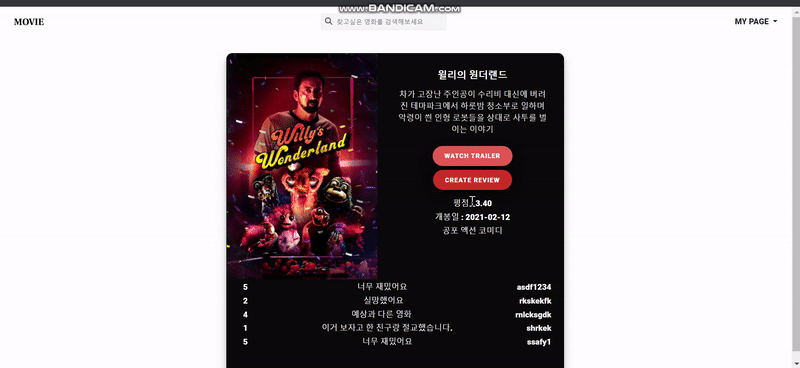
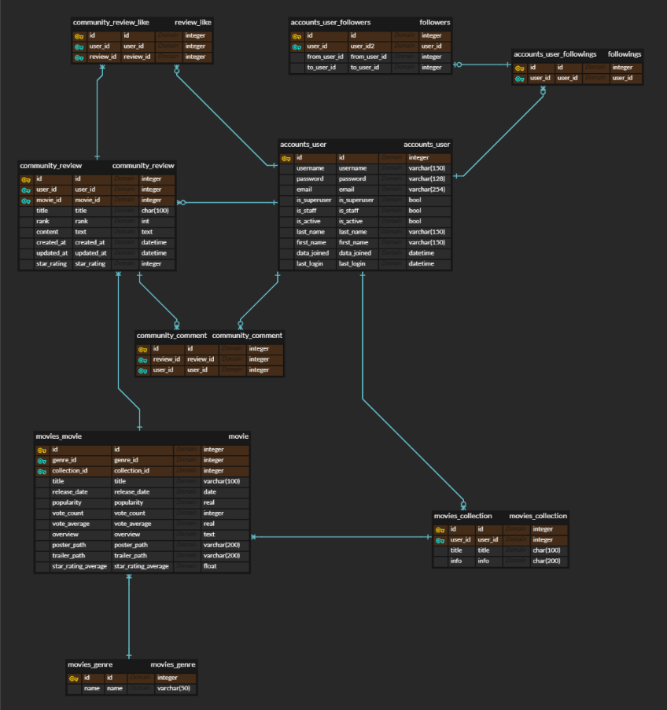

## 영화 정보 커뮤니티

- 목표 : 영화 정보 기반 추천 + 커뮤니티 서비스

   

### 0. 프로젝트 개요

- 진행기간 : 2021.05.20 ~ 2021.05.27
- 사용한 프레임워크 : django, Vue.js

 

### 1. 목표 서비스 구현 및 실제 구현 정도

1. 영화 정보 상세페이지에서 유튜브 트레일러 시청, 리뷰 작성, 다른 사람들 리뷰에 좋아요를 누르거나 코멘트 작성

---

2. 검색을 통해 영화정보 상세 페이지로 이동 (포스터를 클릭해도 이동 가능)

.gif)

---

3. 다른 회원 팔로우 시 내가 팔로우한 모든 회원이 만든 컬렉션 중 1개가 랜덤으로 메인 페이지에 표시

.gif)

---

4. 프로필 페이지에서 나의 컬렉션 생성

.gif)

 

### 2. 데이터베이스 모델링

- user, community_review, community_comment, movie, collection, genre 등으로 이루어져있습니다.

 

